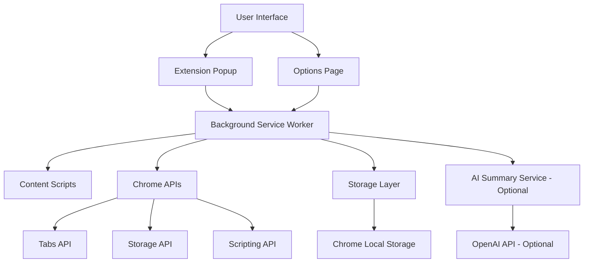

# Design Document
<!-- 설계 문서 - LaterLens 크롬 확장 프로그램의 기술적 아키텍처 및 구현 설계 -->

## Overview
<!-- 전체 개요 - 시스템 아키텍처 및 주요 구성 요소 설명 -->

LaterLens is a Chrome extension built using Manifest V3 architecture that provides seamless web page archiving capabilities. The extension consists of a background service worker, popup interface, options page, and content scripts working together to capture, store, and manage web page data with optional AI-powered summaries.
<!-- LaterLens는 Manifest V3 아키텍처를 사용하여 구축된 크롬 확장 프로그램으로 seamless한 웹페이지 아카이빙 기능을 제공합니다. 백그라운드 서비스 워커, 팝업 인터페이스, 옵션 페이지, 콘텐츠 스크립트가 함께 작동하여 선택적 AI 기반 요약과 함께 웹페이지 데이터를 캡처, 저장, 관리합니다. -->

## Architecture
<!-- 아키텍처 - 시스템의 전체적인 구조 및 컴포넌트 간 관계 -->

### High-Level Architecture
<!-- 고수준 아키텍처 - 주요 컴포넌트와 데이터 흐름을 보여주는 다이어그램 -->



### Extension Components
<!-- 확장 프로그램 구성 요소 - 각 컴포넌트의 역할과 책임 정의 -->

1. **Background Service Worker** (`background.js`)
   <!-- 백그라운드 서비스 워커 - 확장 프로그램의 핵심 로직 처리 -->
   - Handles extension lifecycle and cross-component communication
   - Manages API calls and data processing
   - Coordinates between popup, content scripts, and storage
   <!-- 확장 프로그램 생명주기 및 컴포넌트 간 통신 처리, API 호출 및 데이터 처리 관리, 팝업-콘텐츠 스크립트-스토리지 간 조정 -->

2. **Popup Interface** (`popup/`)
   <!-- 팝업 인터페이스 - 사용자가 저장된 페이지를 보고 관리하는 메인 UI -->
   - Main user interface for viewing saved pages
   - Search and delete functionality
   - Responsive grid layout for saved items
   <!-- 저장된 페이지 보기용 메인 사용자 인터페이스, 검색 및 삭제 기능, 저장된 항목용 반응형 그리드 레이아웃 -->

3. **Options Page** (`options/`)
   <!-- 옵션 페이지 - 확장 프로그램 설정 및 구성 관리 -->
   - Optional AI API key configuration
   - Extension settings management
   - Language preferences
   <!-- 선택적 AI API 키 구성, 확장 프로그램 설정 관리, 언어 설정 -->

4. **Content Scripts** (`content/`)
   <!-- 콘텐츠 스크립트 - 웹페이지에서 데이터 추출 및 조작 -->
   - Page content extraction
   - Open Graph metadata parsing
   - DOM manipulation for data capture
   <!-- 페이지 콘텐츠 추출, Open Graph 메타데이터 파싱, 데이터 캡처를 위한 DOM 조작 -->

5. **Utility Modules** (`utils/`)
   <!-- 유틸리티 모듈 - 공통 기능 및 헬퍼 함수들 -->
   - Storage operations abstraction
   - Optional AI API integration
   - Image processing and caching
   <!-- 스토리지 작업 추상화, 선택적 AI API 통합, 이미지 처리 및 캐싱 -->

## Components and Interfaces
<!-- 컴포넌트 및 인터페이스 - 각 컴포넌트 간의 데이터 교환 및 통신 인터페이스 정의 -->

### Background Service Worker Interface
<!-- 백그라운드 서비스 워커 인터페이스 - 메시지 처리 및 데이터 구조 정의 -->

```javascript
// Message handling interface
// 메시지 처리 인터페이스 - 확장 프로그램 내부 통신용 메시지 구조
interface ExtensionMessage {
  action: 'savePage' | 'getPages' | 'deletePage' | 'searchPages'; // 수행할 작업 타입
  data?: any; // 작업에 필요한 데이터
  tabId?: number; // 대상 탭 ID (선택사항)
}

// Page data structure
// 페이지 데이터 구조 - 저장되는 각 페이지의 정보 구조
interface SavedPage {
  id: string; // 고유 식별자
  url: string; // 페이지 URL
  title: string; // 페이지 제목
  summary: string; // AI 생성 요약 (선택사항) 또는 "요약 없음"
  thumbnail: string; // 썸네일 이미지 (base64 또는 blob URL)
  timestamp: number; // 저장 시각
  domain: string; // 도메인명
}
```

### Storage Layer Interface

```javascript
interface StorageService {
  savePage(page: SavedPage): Promise<void>;
  getPages(): Promise<SavedPage[]>;
  deletePage(id: string): Promise<void>;
  searchPages(query: string): Promise<SavedPage[]>;
  clearAll(): Promise<void>;
}
```

### AI Summary Service Interface (Optional)
<!-- AI 요약 서비스 인터페이스 (선택사항) - API 키가 설정된 경우에만 사용 -->

```javascript
interface SummaryService {
  generateSummary(content: string, apiKey: string): Promise<string>;
  validateApiKey(apiKey: string): Promise<boolean>;
  isConfigured(): boolean; // API 키 설정 여부 확인
}
```

### Content Extraction Interface

```javascript
interface PageExtractor {
  extractMetadata(): Promise<PageMetadata>;
  captureScreenshot(): Promise<string>;
  getPageContent(): Promise<string>;
}

interface PageMetadata {
  title: string;
  description: string;
  ogImage?: string;
  favicon?: string;
}
```

## Data Models
<!-- 데이터 모델 - 애플리케이션에서 사용되는 주요 데이터 구조 및 클래스 정의 -->

### SavedPage Model
<!-- SavedPage 모델 - 저장된 페이지 정보를 관리하는 핵심 데이터 모델 -->

```javascript
class SavedPage {
  constructor(data) {
    this.id = data.id || generateUniqueId();
    this.url = data.url;
    this.title = data.title;
    this.summary = data.summary || '요약 없음';
    this.thumbnail = data.thumbnail;
    this.timestamp = data.timestamp || Date.now();
    this.domain = new URL(data.url).hostname;
  }

  static validate(data) {
    return data.url && data.title && data.thumbnail;
  }

  toJSON() {
    return {
      id: this.id,
      url: this.url,
      title: this.title,
      summary: this.summary,
      thumbnail: this.thumbnail,
      timestamp: this.timestamp,
      domain: this.domain
    };
  }
}
```

### Settings Model

```javascript
class ExtensionSettings {
  constructor() {
    this.apiKey = ''; // 선택사항 - 비어있으면 AI 요약 비활성화
    this.language = 'auto';
    this.maxStorageItems = 1000;
    this.thumbnailQuality = 0.8;
    this.enableAISummary = false; // AI 요약 활성화 여부
  }

  static async load() {
    const data = await chrome.storage.local.get('settings');
    return Object.assign(new ExtensionSettings(), data.settings || {});
  }

  async save() {
    await chrome.storage.local.set({ settings: this });
  }
}
```

## Error Handling
<!-- 오류 처리 - 시스템에서 발생할 수 있는 오류 유형 및 처리 전략 -->

### Error Categories
<!-- 오류 카테고리 - 발생 가능한 오류들을 유형별로 분류 -->

1. **Network Errors**
   <!-- 네트워크 오류 - API 및 외부 서비스 통신 관련 오류 -->
   - API timeout or connection failures <!-- API 타임아웃 또는 연결 실패 -->
   - Invalid API responses <!-- 잘못된 API 응답 -->
   - Rate limiting <!-- 요청 제한 -->

2. **Storage Errors**
   <!-- 스토리지 오류 - 데이터 저장 및 관리 관련 오류 -->
   - Quota exceeded <!-- 저장 용량 초과 -->
   - Data corruption <!-- 데이터 손상 -->
   - Permission denied <!-- 권한 거부 -->

3. **Content Extraction Errors**
   <!-- 콘텐츠 추출 오류 - 웹페이지 데이터 수집 관련 오류 -->
   - Inaccessible pages (CORS, CSP) <!-- 접근 불가능한 페이지 (CORS, CSP 정책) -->
   - Missing metadata <!-- 메타데이터 누락 -->
   - Screenshot capture failures <!-- 스크린샷 캡처 실패 -->

### Error Handling Strategy

```javascript
class ErrorHandler {
  static handle(error, context) {
    const errorInfo = {
      type: error.name,
      message: error.message,
      context: context,
      timestamp: Date.now()
    };

    // Log error for debugging
    console.error('LaterLens Error:', errorInfo);

    // Show user-friendly message
    switch (error.name) {
      case 'QuotaExceededError':
        return this.showStorageFullMessage();
      case 'NetworkError':
        return this.showNetworkErrorMessage();
      case 'APIError':
        return this.showAPIErrorMessage();
      default:
        return this.showGenericErrorMessage();
    }
  }

  static showStorageFullMessage() {
    return {
      title: '저장 공간 부족',
      message: '저장된 페이지가 너무 많습니다. 일부 항목을 삭제해주세요.',
      action: 'openCleanup'
    };
  }
}
```

## Testing Strategy
<!-- 테스트 전략 - 품질 보증을 위한 다양한 테스트 방법론 및 접근법 -->

### Unit Testing
<!-- 단위 테스트 - 개별 컴포넌트 및 함수의 기능 검증 -->

1. **Storage Operations**
   - Test CRUD operations for saved pages
   - Validate data integrity and serialization
   - Test error handling for storage failures

2. **Content Extraction**
   - Mock different page structures
   - Test Open Graph metadata parsing
   - Validate screenshot capture functionality

3. **AI Integration**
   - Mock API responses
   - Test error handling for API failures
   - Validate summary generation logic

### Integration Testing

1. **Extension Lifecycle**
   - Test background service worker initialization
   - Validate message passing between components
   - Test extension installation and updates

2. **User Workflows**
   - End-to-end page saving flow
   - Search and delete operations
   - Settings configuration

### Manual Testing

1. **Cross-Browser Compatibility**
   - Test on different Chrome versions
   - Validate on Chromium-based browsers

2. **Performance Testing**
   - Measure save operation timing
   - Test with large numbers of saved pages
   - Validate memory usage

3. **Accessibility Testing**
   - Keyboard navigation
   - Screen reader compatibility
   - Color contrast validation

### Test Data Management

```javascript
class TestDataGenerator {
  static generateMockPage(overrides = {}) {
    return {
      id: 'test-' + Math.random().toString(36).substr(2, 9),
      url: 'https://example.com/test-page',
      title: 'Test Page Title',
      summary: 'This is a test page summary for testing purposes.',
      thumbnail: 'data:image/png;base64,iVBORw0KGgoAAAANSUhEUgAAAAEAAAABCAYAAAAfFcSJAAAADUlEQVR42mNkYPhfDwAChwGA60e6kgAAAABJRU5ErkJggg==',
      timestamp: Date.now(),
      domain: 'example.com',
      ...overrides
    };
  }

  static generateMockPages(count = 10) {
    return Array.from({ length: count }, (_, i) => 
      this.generateMockPage({ 
        id: `test-${i}`,
        title: `Test Page ${i + 1}` 
      })
    );
  }
}
```

## Security Considerations

### Data Protection
- API keys stored securely in Chrome storage (only if user chooses to enable AI features)
- No sensitive data transmitted to external services except for optional summary generation
- Content scripts run with minimal permissions
- Extension functions fully without any external API dependencies

### Content Security Policy
- Strict CSP for popup and options pages
- Whitelist only necessary external domains
- Prevent XSS through proper data sanitization

### Permission Management
- Request minimal required permissions
- Use activeTab permission for content access
- Implement proper error handling for permission denials